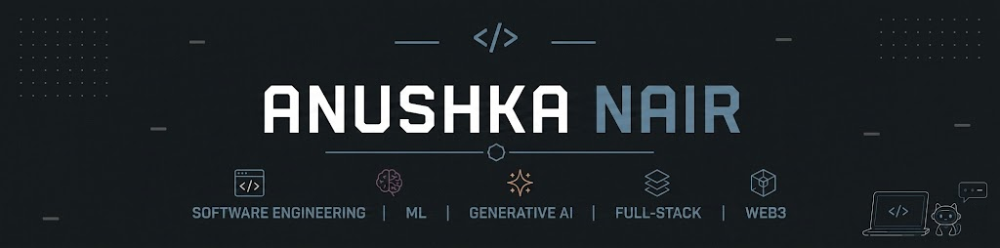
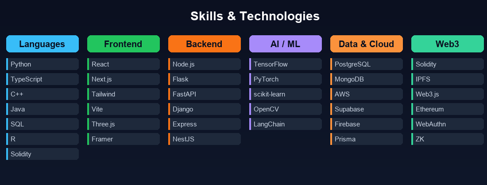

<div align="center">
  
</div>

<br/>

<div align="center">

[](https://www.linkedin.com/in/anushkanair1729/)
[](https://leetcode.com/u/nush1729/)
[](mailto:anushkanair1729@gmail.com)
[](https://nush1729.github.io)
[](https://github.com/nush1729)

</div>

---

## About Me

CSE student at **VIT Vellore** with a **9.45 CGPA**, ranked **Top 5 Merit Holder for two consecutive years**. IEEE conference author.

I build systems where engineering rigour meets real-world utility — identity protocols on Ethereum, healthcare platforms, ML prediction pipelines, and data products. My work spans smart contracts to React dashboards, FastAPI services to TensorFlow pipelines.

**Currently:** Strengthening DSA + system design for top-tech interviews. Open to roles in **Software Engineering**, **Data Science**, and **AI/ML Engineering**.

---

## Featured Projects

### 🗑️ [Adaptive Dump Intelligence](https://github.com/nush1729/adaptive-dump-intelligence)
**Smart waste-site monitoring system** — ingests operational data and applies adaptive analytics to flag overflow risk and optimise collection routes, turning raw sensor data into real-time decision support for sustainability operations.

   

---

### 🪪 [NeuralHash SSI](https://github.com/nush1729/ssi)
**Self-sovereign identity protocol on Ethereum Sepolia** — proves a credential is valid without exposing the underlying document. Combines on-chain smart contracts, IPFS storage, Gemini-powered OCR verification, WebAuthn biometric login, and Merkle-batched proofs for selective disclosure with social recovery.

     

---

### 🏥 [COVID Database Management System](https://github.com/nush1729/Covid-Database-Management-System)
**Full-stack public-health platform** — role-based access for patient records, vaccination tracking, and ML-driven case prediction, backed by a typed Prisma data layer over PostgreSQL and secured with JWT authentication end to end.

      

---

<details>
<summary><b>More projects</b></summary>
<br/>

| Project | What it does | Stack |
|:--------|:-------------|:------|
| [CareBridge](https://github.com/nush1729/CareBridge) | Multi-role hospital management — billing, prescriptions, queues, admin | React · Vite · Supabase |
| [AI-ASL](https://github.com/nush1729/AI-ASL) | Real-time sign language recognition, two-stream preprocessing | TensorFlow · OpenCV · MediaPipe |
| [Bluestock MF Analytics](https://github.com/nush1729/bluestock_mf_capstone) | ETL pipeline, star schema, Monte Carlo, portfolio optimisation | Python · SQLite · Streamlit |
| [Alzheimer Predict](https://github.com/nush1729/Alzheimer-Predict) | Early-stage classification with ML interpretability | Python · scikit-learn |
| [Flipkart Gridlock](https://github.com/nush1729/flipkart_gridlock) | Traffic demand forecasting — spatial/temporal/weather features | Python · XGBoost |
| [InstaCaps](https://github.com/nush1729/InstaCaps) | GenAI Instagram caption & hashtag assistant | Python · LLM APIs |

</details>

---

## Skills

<div align="center">
  
</div>

---

## Tech Stack

                                   

---

## GitHub Stats

<div align="center">


</div>

---

## Achievements

| | |
|:-|:-|
| **9.44 CGPA** | Top 5 Merit Holder, 2 consecutive years — VIT Vellore |
| **IEEE Author** | Conference publication in applied technical research |
| **SDE Intern** | Web Development Internship — prototype to production |
| **10+ Projects** | Healthcare · Identity · Finance · Vision · Prediction · GenAI |

---

## Current Focus

```
DSA + System Design    ──────────────────░░░░   SDE interview readiness
ML / GenAI Products    ────────────────░░░░░░   Model → product pipelines  
AWS & Cloud Infra      ────────────░░░░░░░░░░   Scalable backend systems
Hackathons             ████████████████████████  Active
```

---

<div align="center">
  <sub>
    Open to SDE · Data Science · AI/ML Engineering internships, research collaborations, and hackathon teams.
    <br/>
    <a href="mailto:anushkanair1729@gmail.com">anushkanair1729@gmail.com</a>
    &nbsp;·&nbsp;
    <a href="https://www.linkedin.com/in/anushkanair1729/">LinkedIn</a>
    &nbsp;·&nbsp;
    <a href="https://github.com/nush1729">GitHub</a>
  </sub>
</div>
